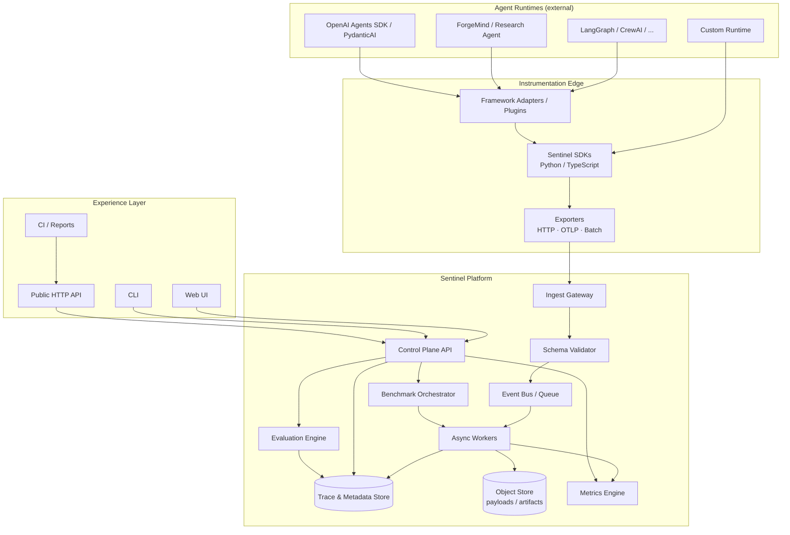

# High-Level Architecture

**Document:** Architecture Proposal — High-Level Design  
**Status:** Accepted for Phase 0  
**Related diagrams:** [docs/diagrams/](../diagrams/)

---

## 1. Architectural Intent

Sentinel AI is a **sidecar measurement platform**:

- Agents run in **their** frameworks.
- SDKs/adapters emit **canonical traces**.
- Sentinel **ingests, stores, analyzes, evaluates, and visualizes**.

Core never embeds LangGraph, CrewAI, or other frameworks. Adapters live at the edge.

---

## 2. Logical Architecture



---

## 3. Layered View

| Layer | Responsibility |
|---|---|
| **Instrumentation** | Capture agent lifecycle with minimal overhead |
| **Transport** | Reliable delivery (HTTP, OTLP, batch files) |
| **Ingest** | Auth, validate, normalize, enqueue |
| **Persistence** | Runs, spans, events, artifacts, indices |
| **Analysis** | Metrics, attribution, aggregations |
| **Evaluation** | Deterministic + judge-based scoring |
| **Benchmark** | Controlled sweeps and comparisons |
| **Experience** | UI, CLI, API, CI reports |

---

## 4. Canonical Domain Model (Conceptual)

```text
Organization (optional, later)
  └── Project
        ├── Environment (dev / staging / prod)
        ├── Agents (logical name + versions)
        ├── Datasets / Suites
        ├── Evaluators / Rubrics
        └── Runs
              ├── Spans (planner, llm, tool, memory, custom)
              ├── Events (retries, errors, logs)
              ├── Metrics (derived)
              ├── Scores (evaluations)
              └── Artifacts (attachments, exports)
```

### Run

A single agent execution attempt (or multi-agent session root), identified by `run_id`.

### Span

A timed unit of work within a run: LLM call, tool invocation, planner step, memory read/write, etc.

### Event

Point-in-time signal: retry, error, checkpoint, user feedback.

### Score

Output of an evaluator against a run (or span), with versioned evaluator identity.

---

## 5. Deployment Topology (Self-Hosted First)

### Local / Developer

```text
Docker Compose:
  - sentinel-api
  - postgres
  - (optional) minio
  - (optional) redis
  - sentinel-ui (or API-served static)
```

### Team Self-Hosted

```text
  Load balancer
       │
  sentinel-api (n)
       │
  redis / NATS (queue)
       │
  workers (n)
       │
  Postgres + object store
```

Hosted SaaS is a **future product surface**, not a Phase 0–3 requirement. The architecture must not preclude it.

---

## 6. Trust Boundaries

| Boundary | Rule |
|---|---|
| Agent process → SDK | User code; may contain secrets—redact before export |
| SDK → Ingest | Authenticated; schema-validated |
| Workers → Store | Internal network; least privilege DB roles |
| UI/API consumers | Scoped keys / session auth |
| Plugins | Process-isolated or clearly sandboxed; never trusted for security boundary alone |

---

## 7. Extension Points

1. **Framework adapters** — map native hooks → schema  
2. **Exporters** — alternate transports  
3. **Evaluators** — scoring plugins  
4. **Metric extractors** — custom aggregations  
5. **Storage backends** — swap Postgres/object implementations behind interfaces  

---

## 8. Design Constraints

1. **Schema stability** beats premature optimization.  
2. **Async export** by default; sync only for tests.  
3. **Idempotent ingest** on event/span IDs.  
4. **Adapters outside core** packages.  
5. **Docs and ADRs** update with every architectural change.

---

## Related Documents

- [Component Responsibilities](./04-component-responsibilities.md)
- [Data Flow](./05-data-flow.md)
- [System Context Diagram](../diagrams/01-system-context.md)
- [ADR-0001 Canonical Trace Schema](../adr/0001-canonical-trace-schema.md)
