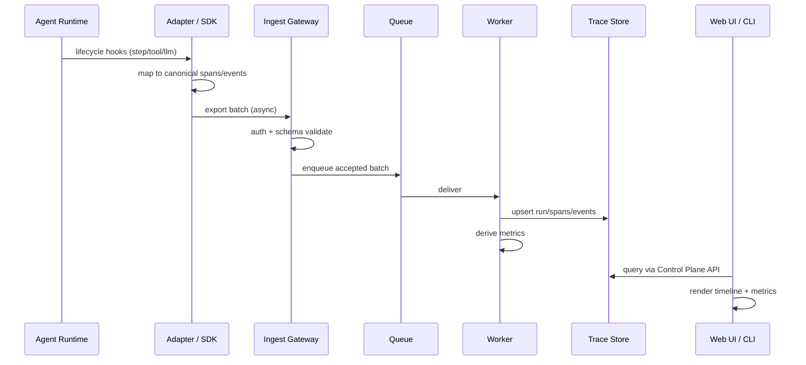
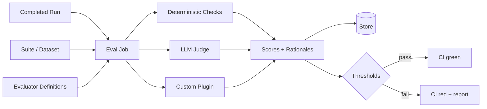

# Data Flow

**Document:** Architecture Proposal — Data Flows  
**Status:** Draft for Phase 0  
**Diagrams:** [docs/diagrams/03-data-flow.md](../diagrams/03-data-flow.md)

---

## 1. Happy Path: Live Run Observability



**Guarantees:**

- At-least-once delivery
- Idempotent upserts on `(project_id, span_id)` / event IDs
- Partial runs visible before `run.end` (streaming UX later)

---

## 2. Offline / CI Batch Upload

```text
Agent CI job
  → writes sentinel-trace.jsonl (or zip)
  → sentinel cli upload ./artifacts
  → Ingest (batch mode)
  → Workers
  → Store
  → optional: sentinel cli eval --suite smoke
  → CI gate (exit code)
```

Useful for air-gapped runners and deterministic pipelines.

---

## 3. Evaluation Flow



Evaluators are **versioned**. Re-scoring a run with a new evaluator version creates new score records; it does not mutate history silently.

---

## 4. Benchmark Comparison Flow

```text
1. Define suite S with tasks T1..Tn and matrix M (models × planners × ...)
2. For each cell in M:
     a. Caller runs agent with config C
     b. SDK emits run tagged with config_hash + agent_version
3. Sentinel evaluates each run against suite criteria
4. Aggregate: success, latency, cost, retries per cell
5. Diff against baseline cell / previous agent_version
6. Emit leaderboard + regression report
```

Sentinel coordinates measurement; the **caller** owns agent execution.

---

## 5. Cost Attribution Flow

```text
LLM span attributes:
  model, provider, tokens_in, tokens_out
        ↓
Pricing table (versioned)
        ↓
estimated_cost_usd
        ↓
Roll up by: run → tool/llm/planner → project/day
```

Tool spans contribute **time** (and optionally external API cost if provided).

---

## 6. Failure & Quarantine Flow

```text
Invalid batch
  → validation error (schema/version)
  → quarantine record + error detail
  → SDK receives 4xx with machine-readable code
  → operator inspects quarantine (CLI/UI)
  → fix adapter/SDK or enable compatibility shim
```

Poison messages must not block the queue.

---

## 7. Redaction Flow

```text
SDK (optional local redaction)
  → Ingest redaction policies (project-level)
  → Stored redacted payloads + redaction markers
  → UI shows redaction notices where fields stripped
```

Prefer redacting **before** durable storage of sensitive raw content.

---

## 8. Key Identifiers

| ID | Scope | Purpose |
|---|---|---|
| `project_id` | tenant/project | Isolation |
| `run_id` | single execution | Primary timeline |
| `span_id` | unit of work | Structure |
| `parent_span_id` | hierarchy | Tree/waterfall |
| `trace_id` | distributed correlation | Multi-process agents |
| `agent_version` | logical release | Regression |
| `config_hash` | config fingerprint | Benchmark cells |
| `schema_version` | wire format | Compatibility |

---

## Related Documents

- [High-Level Architecture](./03-high-level-architecture.md)
- [ADR-0001 Canonical Trace Schema](../adr/0001-canonical-trace-schema.md)
