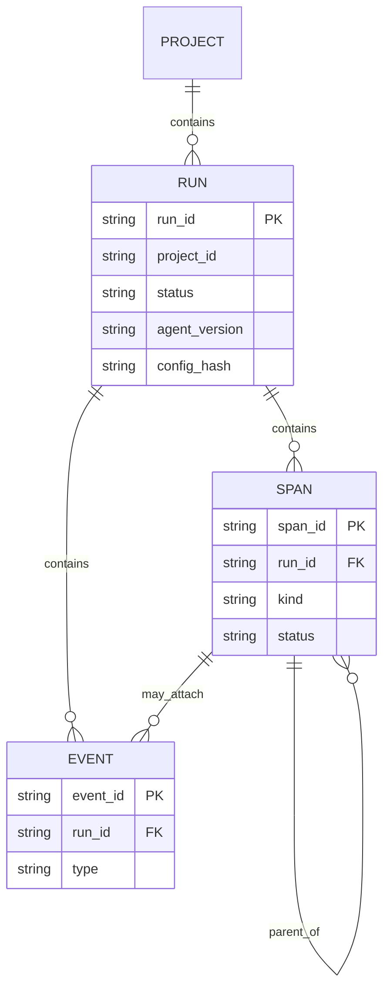

# Trace Schema Reference — v1.0.0

**Status:** Active (Phase 1)  
**Wire version:** `schema_version: "1.0.0"`  
**Source of truth:** [`packages/schema/jsonschema/v1/`](../../packages/schema/jsonschema/v1/)

---

## 1. Entity overview

---

## 2. Required correlation fields

| Field | Run | Span | Event | Batch |
|---|---|---|---|---|
| `schema_version` | ✓ | ✓ | ✓ | ✓ |
| `project_id` | ✓ | ✓ | ✓ | ✓ |
| `run_id` | ✓ | ✓ | ✓ |  |
| `span_id` |  | ✓ |  |  |
| `event_id` |  |  | ✓ |  |
| `started_at` / `timestamp` | `started_at` | `started_at` | `timestamp` | optional `sent_at` |

---

## 3. Span kinds

| Kind | Payload object | Typical use |
|---|---|---|
| `llm` | `llm` (required) | Model calls, token usage |
| `tool` | `tool` (required) | Tool / function calls |
| `planner` | `planner` (optional) | Plan steps |
| `memory` | `memory` (optional) | Memory read/write/search |
| `agent` | — | Agent / graph node boundary |
| `custom` | via `attributes` | Escape hatch |

---

## 4. Event types

`retry` | `error` | `log` | `checkpoint` | `feedback` | `custom`

---

## 5. Ingest batch rules

- `POST /v1/ingest` body = `IngestBatch`
- At least one of `runs`, `spans`, `events` must be non-empty
- Nested entities MUST share the batch `project_id` (server SHOULD reject mismatches in implementation phases)
- Idempotent upserts on `(project_id, run_id|span_id|event_id)`

---

## 6. Compatibility

See [`packages/schema/VERSIONING.md`](../../packages/schema/VERSIONING.md).

---

## 7. Fixtures

| Class | Path |
|---|---|
| Valid | `packages/schema/fixtures/valid/` |
| Invalid | `packages/schema/fixtures/invalid/` |

---

## Related

- [ADR-0001](../adr/0001-canonical-trace-schema.md)
- [OpenAPI stub](../../packages/schema/openapi/openapi.yaml)
- [Data Flow](./05-data-flow.md)
