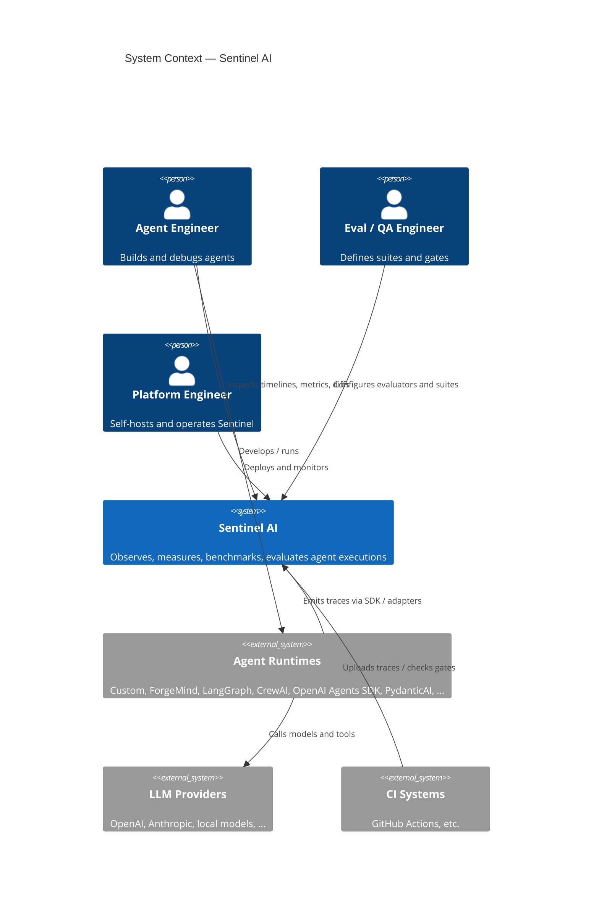

# System Context Diagram

C4 Level 1 — Sentinel AI in its environment.

## Narrative

Actors run agents **outside** Sentinel. Sentinel receives telemetry, stores it, derives metrics and scores, and presents results through UI, CLI, and API. Sentinel does not replace the agent runtime or the LLM provider.
