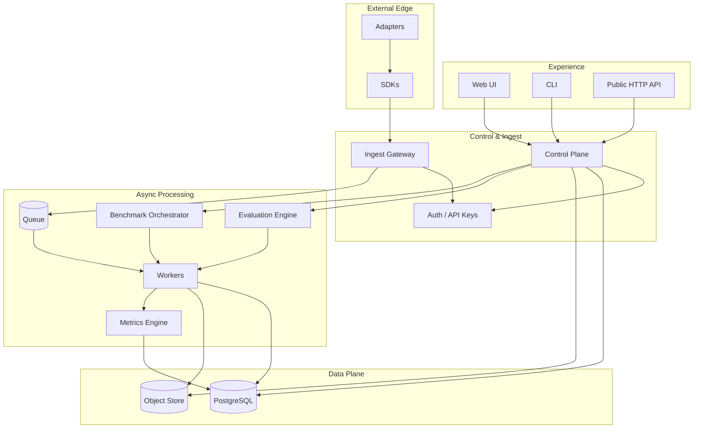

# Component Diagram

C4 Level 2 — Major building blocks inside Sentinel AI.

## Boundary Notes

- **Adapters** never talk to the database directly.
- **UI** is a client of the Control Plane only.
- **Workers** own derived state (metrics, scores), not interactive request threads.
