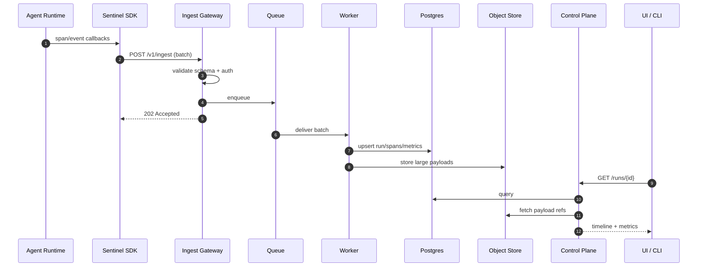
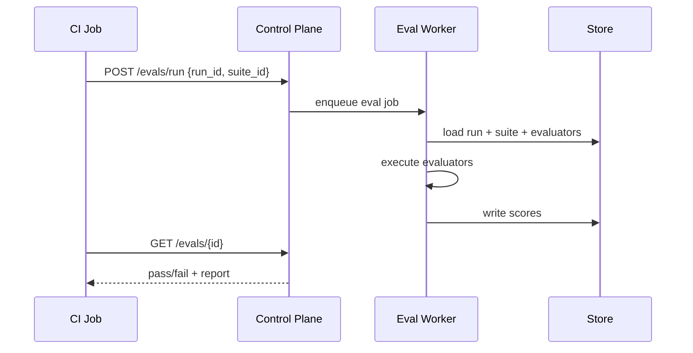

# Data Flow Diagrams

## Live ingest

```mermaid
sequenceDiagram
  autonumber
  participant RT as Agent Runtime
  participant SDK as Sentinel SDK
  participant GW as Ingest Gateway
  participant Q as Queue
  participant W as Worker
  participant PG as Postgres
  participant OBJ as Object Store
  participant API as Control Plane
  participant UI as UI / CLI

  RT->>SDK: span/event callbacks
  SDK->>GW: POST /v1/ingest (batch)
  GW->>GW: validate schema + auth
  GW->>Q: enqueue
  GW-->>SDK: 202 Accepted
  Q->>W: deliver batch
  W->>PG: upsert run/spans/metrics
  W->>OBJ: store large payloads
  UI->>API: GET /runs/{id}
  API->>PG: query
  API->>OBJ: fetch payload refs
  API-->>UI: timeline + metrics
```

## Evaluation gate

```mermaid
sequenceDiagram
  participant CI as CI Job
  participant API as Control Plane
  participant W as Eval Worker
  participant PG as Store

  CI->>API: POST /evals/run {run_id, suite_id}
  API->>W: enqueue eval job
  W->>PG: load run + suite + evaluators
  W->>W: execute evaluators
  W->>PG: write scores
  CI->>API: GET /evals/{id}
  API-->>CI: pass/fail + report
```
