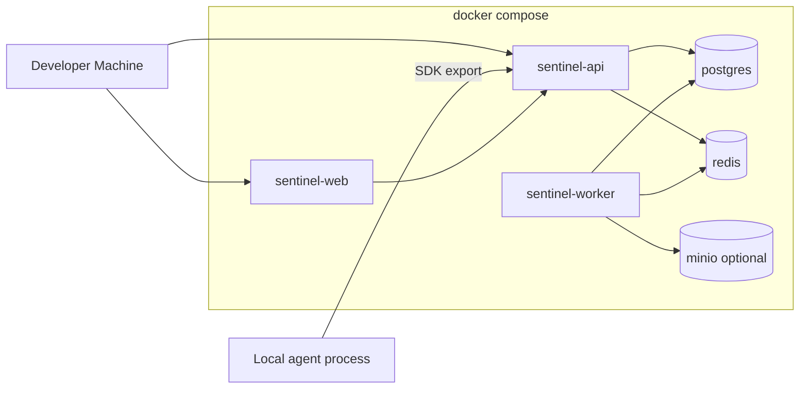
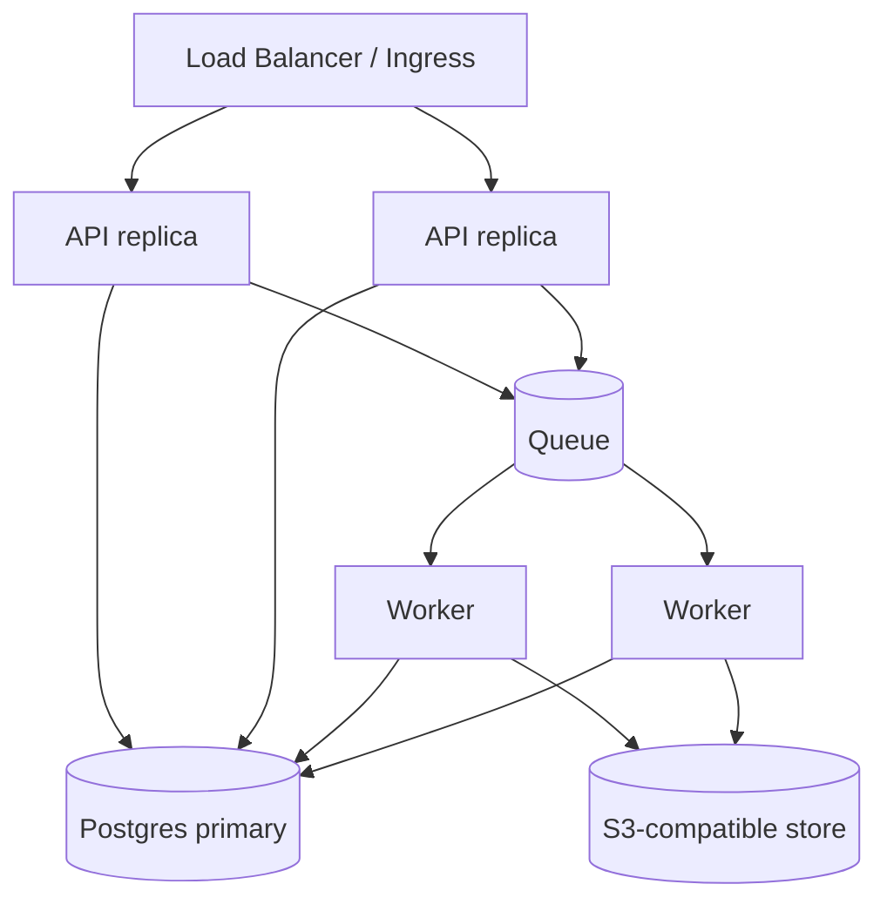

# Deployment Topology

## Local developer (Compose)

```mermaid
flowchart LR
  DEV[Developer Machine]
  subgraph Compose["docker compose"]
    API[sentinel-api]
    W[sentinel-worker]
    PG[(postgres)]
    RD[(redis)]
    MN[(minio optional)]
    WEB[sentinel-web]
  end
  AGENT[Local agent process]
  DEV --> WEB
  DEV --> API
  AGENT -->|SDK export| API
  API --> PG
  API --> RD
  W --> RD
  W --> PG
  W --> MN
  WEB --> API
```

## Team self-hosted (logical)

```mermaid
flowchart TB
  LB[Load Balancer / Ingress]
  API1[API replica]
  API2[API replica]
  Q[(Queue)]
  W1[Worker]
  W2[Worker]
  PG[(Postgres primary)]
  OBJ[(S3-compatible store)]

  LB --> API1
  LB --> API2
  API1 --> Q
  API2 --> Q
  API1 --> PG
  API2 --> PG
  Q --> W1
  Q --> W2
  W1 --> PG
  W2 --> PG
  W1 --> OBJ
  W2 --> OBJ
```

Hosted multi-tenant SaaS topology is intentionally deferred.
