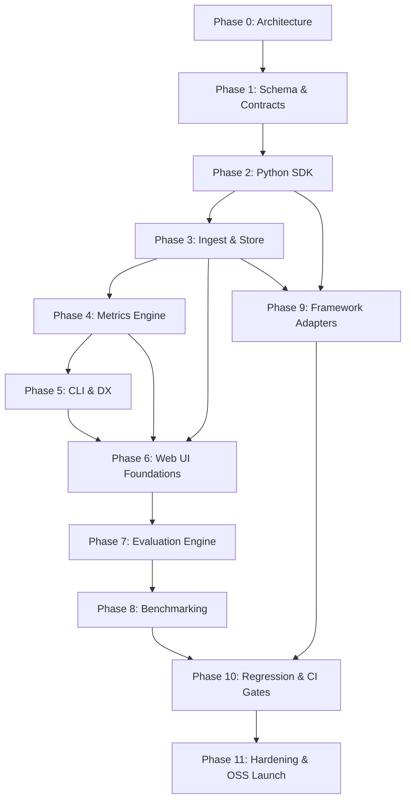

# Roadmap Phase Dependencies

```mermaid
flowchart TD
  P0[Phase 0: Architecture] --> P1[Phase 1: Schema & Contracts]
  P1 --> P2[Phase 2: Python SDK]
  P2 --> P3[Phase 3: Ingest & Store]
  P3 --> P4[Phase 4: Metrics Engine]
  P4 --> P5[Phase 5: CLI & DX]
  P3 --> P6[Phase 6: Web UI Foundations]
  P4 --> P6
  P5 --> P6
  P6 --> P7[Phase 7: Evaluation Engine]
  P7 --> P8[Phase 8: Benchmarking]
  P2 --> P9[Phase 9: Framework Adapters]
  P3 --> P9
  P8 --> P10[Phase 10: Regression & CI Gates]
  P9 --> P10
  P10 --> P11[Phase 11: Hardening & OSS Launch]
```

Phases 5 and 6 may partially overlap after Phase 4 if staffing allows, but each still lands on its own feature branch.
